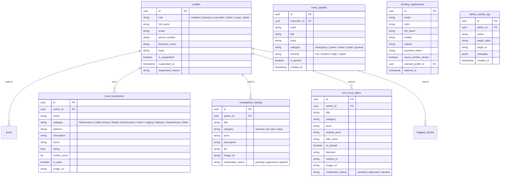

# Hello Hyperlocal Admin Portal — Feature Implementation Specification

**Document Version:** 2.0.0  
**Last Updated:** September 2026  
**Status:** Active Production / Development  
**Repository:** `hello-hyperlocal-admin` (Starting deployment: Hello Linden)

---

## Executive Summary

The **Hello Hyperlocal Admin Portal** is the centralized operational and administrative console for the Hello Hyperlocal ecosystem. It provides municipal ward oversight, community moderation, commercial directory governance, resident onboarding, media asset processing, analytics monitoring, and dashboard security.

The portal operates against the same unified Supabase PostgreSQL database, authentication system, and Cloudflare R2 media bucket utilized by the Expo React Native mobile application (`hello-hyperlocal-rebuild`) and the public marketing/landing web application (`hello-hyperlocal-landing-v2`).

---

## Technology Stack & Architecture

| Layer | Technology | Version / Notes |
| :--- | :--- | :--- |
| **Framework** | Next.js (App Router, Turbopack) | `16.3.1` |
| **Language** | TypeScript (Strict Mode) | `^5.x` |
| **Styling** | Tailwind CSS v4, PostCSS | `@tailwindcss/postcss ^4.0` |
| **UI Components** | shadcn/ui & Radix UI Primitives | Accessible, unstyled headless primitives |
| **Icons** | Lucide React | `^1.16.0` |
| **Database & Auth** | Supabase (PostgreSQL 15+, Auth, Storage/RLS) | `@supabase/supabase-js ^2.99.1`, `@supabase/ssr ^0.9.0` |
| **Media Storage** | Cloudflare R2 (S3 API) + Sharp | Zero-egress bandwidth, auto-converted to WebP |
| **Email Delivery** | Resend API | `@resend/node` / `resend ^4.1.2` |
| **Analytics** | Google Analytics 4 (Data API) | `@google-analytics/data ^4.13.0` |
| **Notifications** | Sonner | Stacked toast feedback system |
| **Typography** | Google Fonts (`next/font/google`) | Bricolage Grotesque (Headings), Geist (Body), Geist Mono (Code) |

---

## Implemented Features & Modules

### 1. Dashboard Overview & Analytics

#### High-Level Dashboard (`/`)
- **Metric KPI Cards**: Total Registered Users, Active Businesses, Pending Moderation Items, Unclaimed Landing Registrations.
- **Quick Actions Panel**: Direct modals to Add User, Create Business, Issue Ward Update, and Review Flagged Posts.
- **Recent Audit Activity**: Live feed of operations logged to `admin_activity_log` with actor, event type, entity ID, and timestamp.
- **Preview Mode Support**: Safe fallback demonstrating sample data when database credentials are not supplied or `NEXT_PUBLIC_PREVIEW_MODE=true`.

#### Website Analytics (`/analytics`)
- **Google Analytics 4 Data API Integration**: Direct server-to-server connection using a Google Cloud Service Account (`GA4_CLIENT_EMAIL`, `GA4_PRIVATE_KEY`, `GA4_PROPERTY_ID`).
- **Real-Time Traffic Metrics**: Active users in the last 30 minutes, total visitors, session counts, and page views for `hellohyperlocal.co.za`.
- **Top Landing Pages & Sources**: Table of high-traffic entry points, UTM campaigns, and referral sources.
- **Device & Geography Breakdown**: Visual breakdown of desktop vs. mobile users, operating systems, and top geographic locations.
- **Date Range Filtering**: 7-day, 14-day, 30-day, and 90-day timeframes with metric trends.

---

### 2. Content Moderation & Community Safety (`/moderation`)

- **Multi-Type Moderation Queue**: Single tabbed interface managing:
  1. **Community Posts** (`posts` table)
  2. **Marketplace Items** (`marketplace_listings` table)
  3. **Love Local Offers** (`love_local_offers` table)
  4. **Flagged Reports** (`flagged_reports` table)
- **Author & Reporter Attribution**: Automatic resolution of user profile details (`full_name`, `business_name`, `email`) for post creators and reporting residents.
- **Destructive Action Guardrails**:
  - `AlertDialog` confirmation modals preventing accidental rejections or removals.
  - Required moderation reasoning field captured upon rejection, stored in audit logs, and piped into user notifications.
- **Direct Content Creation**:
  - **"Create Community Post" Dialog**: Allows administrators to immediately draft and publish pre-approved, high-priority neighborhood announcements.
- **Audit Logging**: Every approval and rejection triggers a logged entry in `admin_activity_log` with moderator ID, target entity, and rationale.

---

### 3. Commercial Directory & Marketplace (`/listings`)

- **Unified Business Taxonomy ([`src/lib/listings-types.ts`](file:///c:/Projects/apps/hello-linden-admin/src/lib/listings-types.ts))**:
  - Synchronized category enum shared across client dialogs and server actions:
    - `Restaurants`
    - `Coffee Shops`
    - `Retail`
    - `Guesthouses`
    - `Hotel / Lodging` *(New)*
    - `Markets`
    - `Experiences`
    - `Other` *(New)*
- **Local Businesses Management** (`local_businesses` table):
  - Table displaying business name, category, address, review score, open/closed status, and creation date.
  - Multi-field **Add Business** modal: Business Name, Category Select, Physical Address, Description, Operating Hours, Cover Image Uploader, and Open/Closed toggle.
  - **Slide-Over Detail Sheet (Option A)**: Clicking any table row opens a slide-over drawer from the right, showing high-res cover photos, operating hours, address + Google Maps link, GPS coordinates, full description, star ratings, and quick actions.
  - **Dedicated Full-Page Edit Route (Option B - `/listings/business/[id]`)**: Deep editor accessible via "Edit Full Details" in the slide-over sheet or actions menu. Supports editing core info, location, hours, description, Cloudflare R2 cover image replacement (`FileUploader`), status toggles, and seeded rating overrides.
  - **Guarded Deletion System**: `deleteBusiness(id)` server action protected by `AlertDialog` confirmation modals and audit logging to `admin_activity_log`.
  - **Table Actions Dropdown**: Dedicated `...` menu with View Details, Edit Business, Toggle Open/Closed, and Delete Business.
  - **Mobile Responsive Design**: Touch-friendly targets, horizontal scroll containment (`overflow-x-auto`), adaptive drawer width (`w-full sm:max-w-lg md:max-w-xl`), and responsive multi-column to single-column form stacking.
- **Classifieds & Marketplace** (`marketplace_listings` table):
  - Overview of resident classified items with title, price in ZAR, category (`services`, `for-sale`, `stays`), status, and moderation unpublish controls.
  - Slide-over sheet inspection for full photo galleries, seller contact, and asking price.
  - Permanent delete action with confirmation modal.
  - **Create Marketplace Listing** modal with pre-approved administrator attribution.
- **Love Local Specials & Offers** (`love_local_offers` table):
  - Local merchant discount promotion system.
  - Supports promotional pricing (original price vs. offer price), discount percentages, promotional expiration dates, and "Special" badge highlights.
  - Slide-over sheet inspection for promo details, terms, and participating business.
  - Unpublish / reject and permanent delete actions.

---

### 4. Ward Updates & Municipal Bulletins (`/ward-updates`)

- **Civic Broadcast Pipeline**: Official municipal announcement system feeding into the mobile app's top-pinned ward banner.
- **Urgent Alert Categorization**:
  - Emergency / Disaster
  - Power & Electricity (Load-shedding schedules, substation faults)
  - Water & Sanitation (Outages, maintenance)
  - Roads & Transport (Pothole repairs, closures)
  - General Municipal News
- **Severity & Pinning Flags**:
  - Severity level (`low`, `medium`, `high`, `urgent`).
  - `is_pinned` toggle to lock critical bulletins to the top of the mobile resident feed.
- **Councillor & Ward Attribution**:
  - Attribute updates directly to the designated Ward Councillor (e.g. Ward 99).
  - Track author profile, publication status, and resolution updates.

---

### 5. Landing Page Registrations Triage (`/registrations`)

- **Early Access / Waitlist Ingestion**: Direct triage of resident, merchant, and councillor registrations originating from `hellohyperlocal.co.za`.
- **Role Taxonomy**:
  - Residents (`resident`)
  - Founding Businesses (`founding_business`)
  - Ward Councillors (`councillor`)
  - Community Volunteers / Champions (`volunteer`)
- **Actionable Workflow**:
  - Search by name, email, mobile number, or suburb.
  - Review window sticker requests (`wants_window_sticker`).
  - **Account Provisioning**: One-click action to convert an inbound waitlist entry into an authenticated resident, business, or councillor user account.
  - **Claim Status**: Displays whether a waitlist entry has claimed their profile (`claimed_profile_id`, `claimed_at`).

---

### 6. User & Directory Management (`/users`, `/users/[id]`)

- **Unified User Directory**:
  - Searchable by name, business name, phone number, and email.
  - Role-based filtering (`resident`, `business`, `councillor`, `admin`, `super_admin`).
  - Suspension status badges (`Active`, `Suspended`).
- **Direct User Provisioning ("Add User" Modal)**:
  - Create accounts directly from the admin dashboard without requiring the resident to download the app first.
  - Configures initial role, full name, phone number, ward, and optional business name.
- **Detailed User Profile Inspector (`/users/[id]`)**:
  - Full account profile, contact details, suburb, ward assignment, joined timestamp.
  - Historical activity: Submitted posts, marketplace listings, and report history.
  - **Account Suspension System**:
    - Guarded with `AlertDialog` requiring a mandatory suspension reason.
    - Revokes active sessions and updates `is_suspended`, `suspended_at`, and `suspended_reason`.
    - One-click **Reactivate Account** button.

---

### 7. Ward Councillors Portal (`/councillors`)

- **Civic Governance**: Dedicated interface for managing Ward Councillors and municipal representatives.
- **Invitation Seams**:
  - **Mobile App Deep-Link Invites**: Generates cryptographically secure 7-day tokens using the custom app scheme:
    `hello-hyperlocal://invite/<token>`
  - Dispatches invitation emails via Resend with mobile onboarding instructions.
  - One-click copy for manual link distribution via WhatsApp or SMS.
- **Direct Councillor Account Creation**:
  - Provision councillor login with designated ward (e.g., Ward 99) and temporary password.

---

### 8. Admin Team & Access Control (`/admin-team`, `/invite/[token]`)

- **Role-Based Access Control (RBAC)**:
  - `super_admin`: Full system control, team management, environment settings.
  - `admin`: User management, commercial listings, ward bulletins, moderation.
  - `moderator`: Content approval/rejection, flagged report triage.
- **Web Admin Invitation Flow**:
  - Modal to invite new administrators via email.
  - Generates secure token stored in `admin_invites` table.
  - Dispatches branded email via Resend linking to `/invite/<token>`.
- **Public Invite Acceptance Route (`/invite/[token]`)**:
  - Validates token against database (checking 7-day expiry and revocation status).
  - Client interface for new administrators to set their password, enter their full name, and activate their dashboard account.
  - Automatic audit logging and token retirement upon successful registration.

---

### 9. Email Notifications Template Engine (`/email-templates`)

- **Standalone Interactive Preview Screen**: Accessible via **Settings & System > Email Templates**.
- **8 Core Production Email Templates**:
  1. **Admin Team Invite** (`admin-invite`): Welcome email with credentials setup and 7-day expiration.
  2. **Ward Councillor Invite** (`councillor-invite`): Dedicated mobile invitation for civic representatives with deep-link CTA.
  3. **Login OTP Verification** (`login-otp`): High-security 6-digit verification box with phishing warnings and 10-minute expiry.
  4. **Password Reset Request** (`password-reset`): Branded password recovery link with 1-hour expiration warning.
  5. **Content Approved** (`content-approved`): Notification to residents when posts or listings are approved.
  6. **Content Needs Revision** (`content-rejected`): Moderation notice specifying feedback and revision buttons.
  7. **Ward Municipal Alert** (`ward-broadcast`): Urgent civic/outage broadcast with severity badges and affected ward numbers.
  8. **Welcome New Resident** (`welcome-resident`): Resident onboarding guide with community guidelines.
- **Responsive Viewport Switcher**: Toggle between **Desktop (600px)** and **Mobile (375px)** to test rendering.
- **Isolated Iframe Architecture**: Renders HTML in an isolated `srcDoc` iframe to prevent dashboard Tailwind styles from corrupting email markup.
- **Live Variable Inspector**: Modify recipient name, invite URLs, OTP codes, rejection feedback, and ward numbers in real-time with instant hot-reload and "Reset to Defaults".
- **Multi-Tab Code Viewer**:
  - **Visual Preview**
  - **Raw HTML** (with 1-click Copy button for Supabase Auth Email Templates)
  - **Plain Text** (with 1-click Copy button)
- **Live Resend Dispatcher**: Send sample emails directly to the logged-in administrator's inbox.
- **Unified Delivery Seam ([`src/lib/email.ts`](file:///c:/Projects/apps/hello-linden-admin/src/lib/email.ts))**: Production invite and OTP functions (`sendInviteEmail`, `sendOtpEmail`) compile using the new template engine, sending both HTML and plain text for optimal deliverability.

---

### 10. Cloudflare R2 Zero-Egress Media Pipeline

- **S3-Compatible Zero-Egress Architecture**: Replaces traditional Supabase storage for media to eliminate bandwidth egress fees.
- **Automatic WebP Conversion & Compression**:
  - Upload API endpoint (`/api/upload`) intercepts uploaded images (`multipart/form-data`).
  - Utilizes `sharp` to resize (max dimension 1600px) and compress images to high-efficiency WebP format (quality 80).
  - Reduces image sizes by **60% to 95%** with negligible perceptual loss.
- **Immutable CDN Caching**:
  - Cryptographically hashed filenames (`<uuid>-<timestamp>.webp`).
  - Serves headers: `Cache-Control: public, max-age=31536000, immutable`.
- **UI Uploaders**:
  - **`FileUploader`**: Multi-file drag-and-drop zone with real-time uploading progress bar, byte formatting, and thumbnail previews.
  - **`AvatarUploader`**: Profile photo editor in Account Settings updating avatar state in real-time.

---

### 11. Authentication, Security & Session Management

- **Supabase Auth Integration**:
  - Email & password authentication with strict password validation.
  - Two-Factor / First-Login OTP verification screen (`/verify-otp`).
  - Password recovery flow (`/forgot-password` and `/reset-password`).
- **PKCE Authentication Callback (`/auth/callback`)**:
  - Server route exchanging auth code for session tokens, ensuring seamless transitions across custom domains and email verification links.
- **Dual Supabase Client Architecture**:
  - **Client-Side** (`createClient`): Uses anonymous publishable key respecting PostgreSQL Row Level Security (RLS).
  - **Server-Side** (`createAdminClient`): Server-only client using `SUPABASE_SERVICE_ROLE_KEY` for privileged operations and activity logging.
- **Append-Only Audit Trail (`admin_activity_log`)**:
  - Centralized audit log tracking actor ID, action type, target table, entity ID, and metadata JSON.

---

### 12. UI/UX Design System & Typography

- **Brand Parity with Landing Page**:
  - **Color Palette**: Dark Spruce (`#1C472A`), Grass Green (`#7ED957`), and warm neutral card surfaces.
  - **Custom Logo**: Star-13 `HyperlocalLogo` badge.
- **Strict Typography Architecture**:
  - **Headings (`--font-heading`)**: **Bricolage Grotesque** enforced across `h1`–`h6`, card titles, dialog headers, and alerts.
  - **Body (`--font-sans`)**: **Geist** for table copy, inputs, forms, and general paragraphs.
  - **Monospace (`--font-mono`)**: **Geist Mono** for hashes, tokens, codes, and coordinates.
- **Header Notification Center**:
  - Live notification bell with unread indicator badge tracking pending moderation items and landing page submissions.
- **Responsive Layout**:
  - Collapsible desktop sidebar and mobile-friendly sheet drawer.
  - Adaptive padding across mobile, tablet, and desktop viewports.

---

## Database Schemas & Key Relations

---

## Planned Features & Future Roadmap

The following features represent the next phases of development for the Hello Hyperlocal administration platform:

### Phase 1: Real-Time Mobile Push Notifications Dispatch
- **Expo Push Service Integration**: Direct trigger from **Ward Updates** and **Moderation Actions** to push notifications onto residents' phones.
- **Targeted Geo-Push**: Ability to blast push notifications filtered by specific Wards, suburbs, or radius around an incident.
- **Emergency Broadcast Override**: High-priority alert channel capable of triggering distinct emergency notification sounds on user devices.

### Phase 2: Bulk Operations & Reporting
- **Data Export Engine**: Export resident registrations, directory listings, and audit logs to structured CSV and Excel formats.
- **Bulk Moderation Triage**: Select-all capabilities to batch approve or batch dismiss low-risk classified listings and community posts.
- **Automated Weekly Digest Generator**: Scheduled cron job compiling weekly ward stats, new merchant registrations, and engagement numbers into an automated executive email report.

### Phase 3: Interactive Geographic & Ward Mapping
- **Interactive Ward Boundary Viewer**: Integration of Leaflet / Mapbox with GeoJSON boundaries for Ward 99 and surrounding areas.
- **Geotagged Incident Map**: Pinpoint municipal issues (water leaks, power outages, road closures) visually on the neighborhood map.
- **Business Density Heatmap**: Visual overview of local merchant adoption across high streets (e.g. 4th Avenue Linden).

### Phase 4: AI-Powered Moderation & Automation
- **Automated Content Pre-Screening**: Integration with Google Gemini API to analyze post text and listing imagery for:
  - Explicit / prohibited imagery
  - Spam, scam patterns, and duplicate merchant listings
  - Hate speech, harassment, and toxic discourse
- **Automated Categorization**: AI suggestion for business and marketplace categories based on merchant description text.

### Phase 5: Business Verification & Merchant Portal Bridge
- **Verified Merchant Badging**: Multi-step document verification workflow (CIPC registration papers, utility bills) to grant official "Verified Local Merchant" badges.
- **Merchant Claim Requests**: Allow claimed business owners to request ownership transfers through the admin panel with administrative review.
- **Sticker Fulfillment Tracker**: Physical window sticker dispatch manager with tracking barcodes and postal statuses.

### Phase 6: Multi-Neighborhood Tenant Expansion
- **Neighborhood Switcher**: Architectural scaling from "Hello Linden" to multi-suburb networks (e.g. Greenside, Parkhurst, Craighall, Blairgowrie).
- **Tenant-Scoped Data Isolation**: Role-based access ensuring ward councillors and neighborhood moderators only view and administer data within their geographic jurisdiction.
- **Global Super-Admin Command**: Unified cross-neighborhood analytics and aggregate reporting for platform management.

---

## Verification & Quality Assurance

All production code meets the following automated verification standards:

- **Type Safety**: Full compliance with TypeScript strict mode across all routes, server actions, and shared components.
- **ESLint**: 0 errors, 0 warnings under React 19 / Next.js ESLint 9 configuration.
- **Deliverability**: Resend email layouts conform to CAN-SPAM and GDPR requirements, including mandatory plain-text versions and one-click unsubscribe footers.
- **Zero-Egress Asset Delivery**: All uploaded imagery undergoes lossless/high-quality WebP transcode via `sharp` before being written to Cloudflare R2.
